<h1 align="center">BensinKu</h1>

<p align="center">
  <strong>Pencatat bahan bakar pribadi dengan prediksi adaptif.</strong><br/>
  Rapikan pengeluaran bensin, rekam rute perjalanan, dan biarkan aplikasi belajar pola berkendaramu.
</p>

<p align="center">
  Dibangun dengan <strong>Flutter</strong> + <strong>Supabase</strong> + <strong>OpenAI</strong>
</p>

<p align="center">
  
  
  
  
  
</p>

<p align="center">
  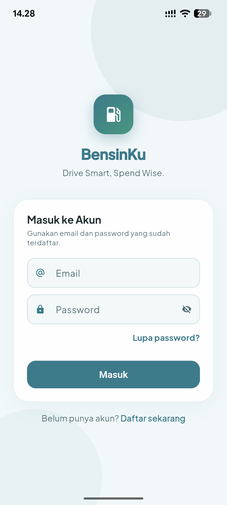
</p>

---

## Table of Contents

- [Overview](#overview)
- [Features](#features)
- [Screenshots](#screenshots)
- [Tech Stack](#tech-stack)
- [Architecture](#architecture)
- [Database Schema](#database-schema)
- [Edge Functions](#edge-functions)
- [Repo Structure](#repo-structure)
- [Getting Started](#getting-started)
- [License](#license)

---

## Overview

BensinKu adalah aplikasi mobile untuk **memantau pengeluaran bahan bakar** kendaraan pribadi (motor & mobil). Berbeda dari sekadar buku catatan digital, BensinKu memakai pendekatan **prediksi adaptif** — sistem menggabungkan data referensi kendaraan dengan pengukuran nyata dari setiap siklus full-tank → full-tank, lalu menghasilkan estimasi konsumsi yang makin akurat seiring data bertambah.

Untuk mempercepat input, BensinKu juga punya dua jalur AI: **scan struk SPBU** lewat kamera (OCR + parsing terstruktur) dan **input suara** ("isi pertamax 50 ribu di motor") yang langsung diparse jadi entri pengisian.

### Bagaimana cara menghindari cold-start?

Masalah klasik aplikasi tracker: hari pertama install, sistem tidak tahu apa-apa tentang user. Mau dirata-rata dari trip apa? Belum ada trip. Mau prediksi konsumsi pakai apa? Belum ada satu pun pengisian. Jadi prediksi awal ngawur, atau worse, ditampilin sebagai "—" sampai user manual ngumpulin data berminggu-minggu.

BensinKu menyiasati ini dengan **Bayesian blending** antara dua sumber sinyal:

1. **Prior** — dihitung dari data referensi yang user isi saat onboarding (CC mesin, tahun produksi, transmisi, tipe bodi, profil pakai, kota utama). Sistem punya tabel baseline km/L per kategori kendaraan (mis. motor 110cc → 55 km/L; SUV 1500cc → 10 km/L), lalu mengaplikasikan multiplikasi:

   ```
   prior = base × ageFactor × transmissionFactor × cityFactor
   ```

   Faktor-faktor ini menyesuaikan dengan realita: kendaraan tua boros 15–25%, matic di kota macet boros 10%, Jakarta minus 20% efisiensi vs jalan luar kota. Dari hari pertama, sistem sudah punya angka realistis tanpa data trip apa pun.

2. **Likelihood (sample)** — tiap kali user mencatat pengisian dengan flag `is_full_tank=true`, sistem otomatis cari pengisian penuh sebelumnya untuk kendaraan yang sama, hitung jarak tempuh di interval itu (dari odometer atau trip GPS), lalu insert satu row di `fuel_efficiency_samples` dengan km/L terukur. Ini adalah ground truth nyata milik user.

3. **Posterior** — kombinasi keduanya pakai weighted mean:

   ```
   posterior = (α · prior + Σ samples) / (α + n)
   ```

   `α = 8` (prior weight dalam "effective measurements"). Artinya:
   - **n = 0**: posterior = prior. UI menampilkan badge `PRIOR` ("setup awal").
   - **n = 4**: prior dan sampel kira-kira berbobot sama. Badge `MIXED`.
   - **n = 24+**: bobot prior tinggal ~25%, sampel mendominasi. Badge `DATA-DRIVEN`.

Jadi pengguna langsung dapat angka yang masuk akal di hari pertama, lalu prediksi otomatis bergeser mendekati pengukuran nyata seiring waktu — tanpa harus klik tombol "kalibrasi" atau menunggu jumlah data minimum.

### Roadmap untuk akurasi yang makin tajam

Fondasi sekarang sudah membungkus sinyal terkuat (prior + full-tank ground truth). Beberapa lapisan yang direncanakan untuk meningkatkan akurasi lebih jauh:

- **Cluster konteks per perjalanan** — tag setiap trip GPS dengan time-of-day, weekday/weekend, durasi, kecepatan rata-rata. Lalu pakai k-means sederhana untuk memisahkan pola (mis. 3 cluster: komuter pagi, leisure weekend, long-trip mudik). Prediksi akan menimbang bobot tiap cluster sesuai pola minggu user — Senin pagi vs Sabtu sore akan punya estimasi berbeda.

- **Anomaly detection** — flag entri yang mencurigakan: liter di luar batas wajar tanki, harga per liter outlier, atau km tempuh tidak konsisten dengan trip log. Sample bermasalah ditandai untuk review user, bukan langsung membusuki posterior. Saat ini outlier difilter dengan range guard (km/L 2–100) sebagai backstop minimal.

- **Auto-correction dari pola jangka panjang** — kalau sampel terus konsisten lebih rendah dari prior (mis. motor user ternyata boros karena modifikasi atau kondisi), sistem akan turunkan bobot prior lebih cepat. Sebaliknya kalau sampel sangat variabel, prior dipertahankan lebih lama untuk stabilitas.

- **Cross-user signal (collaborative)** — kendaraan dengan spesifikasi mirip bisa saling melengkapi. User baru dengan Vario 125 2020 di Jakarta langsung dapat prior yang lebih tajam karena sudah ada data agregat dari user lain dengan kombinasi serupa. Implementasi-nya butuh privacy-preserving aggregation (k-anonymity ≥ 5) di sisi server.

- **Per-trip efficiency** — selama ini sample diukur full-tank ke full-tank. Kalau odometer dicatat tiap pengisian, sistem bisa hitung efisiensi per pengisian (bukan per cycle), memberi ~3–4× lebih banyak data point.

- **Pendekatan eksplisit: bukan RAG dengan embedding** — sengaja dipilih jalur statistik klasik. Masalah prediksi konsumsi adalah numerical regression dengan time series, bukan retrieval. Embedding tidak akan menambah sinyal baru di atas data deret angka yang sudah ada.

---

## Features

| Fitur | Deskripsi |
|---|---|
| **Beranda** | Greeting kontekstual, ringkasan bulan ini, pengisian terakhir, dan prediksi sisa BBM |
| **Smart Prediction** | Bayesian blend antara prior (CC, body, transmisi, profil pemakaian) + sampel km/L aktual dari tiap full-tank cycle |
| **Scan Struk** | Foto struk SPBU → AI vision parse otomatis nominal, liter, tipe BBM, dan tanggal |
| **Voice Input** | Speech-to-text + LLM untuk parse "isi pertamax 50 ribu di motor" → entri terstruktur |
| **Trip Tracker GPS** | Rekam rute perjalanan real-time, tetap berjalan saat layar mati (foreground service) |
| **Analisa** | Grafik pengeluaran, jarak tempuh, dan efisiensi per periode |
| **Arsip** | Daftar pengisian dengan filter periode dan kendaraan |
| **Garasi** | Manajemen kendaraan dengan detail mesin lengkap untuk akurasi prediksi |
| **Onboarding Berlapis** | Profil → Kendaraan (lengkap dengan CC/tahun/bodi/transmisi) → Preferensi (profil pakai + kota utama) — wajib diisi semua sebelum masuk dashboard |

---

## Screenshots

<p align="center">
  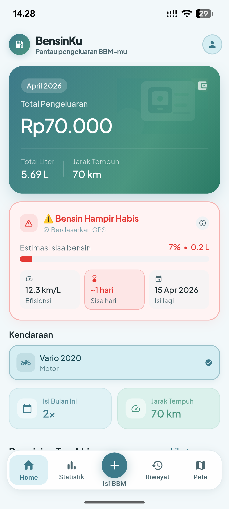
  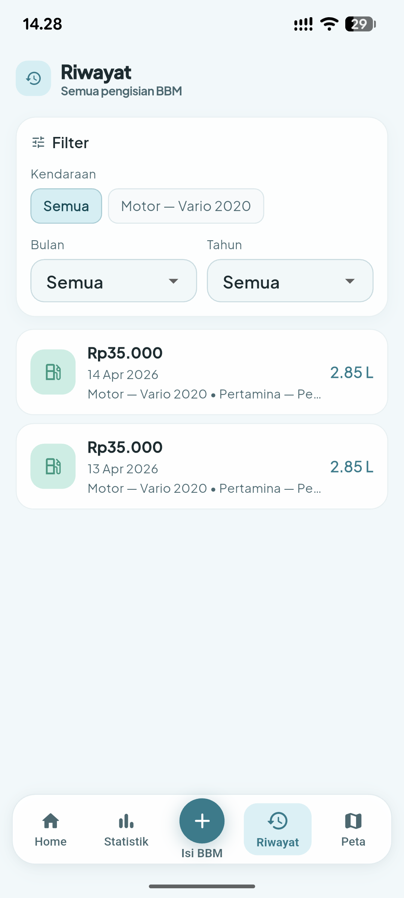
  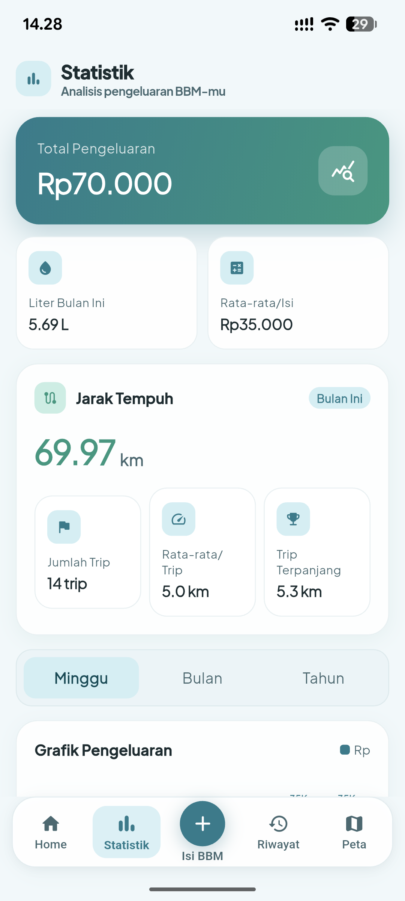
  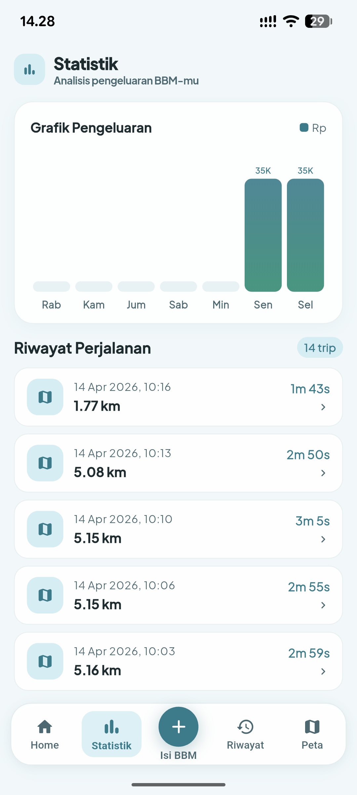
</p>

<p align="center">
  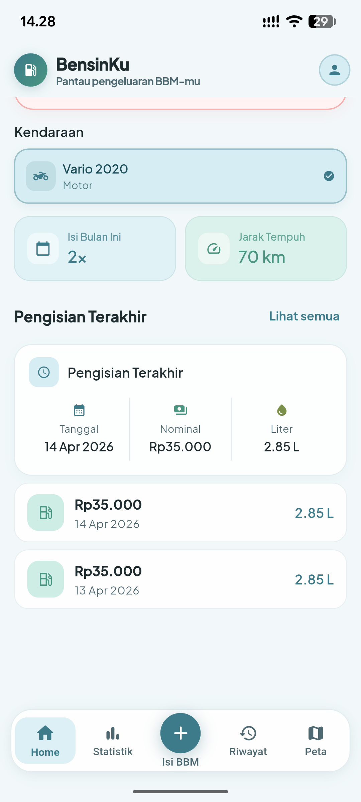
  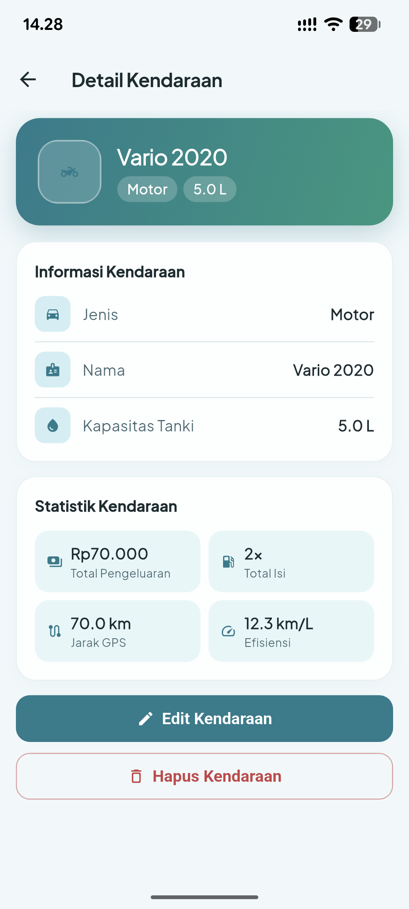
  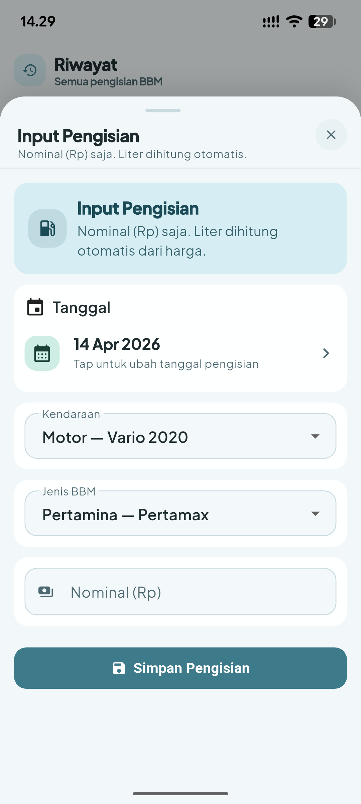
  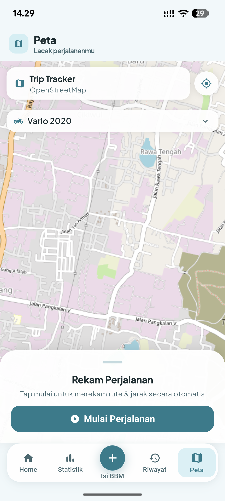
</p>

<p align="center">
  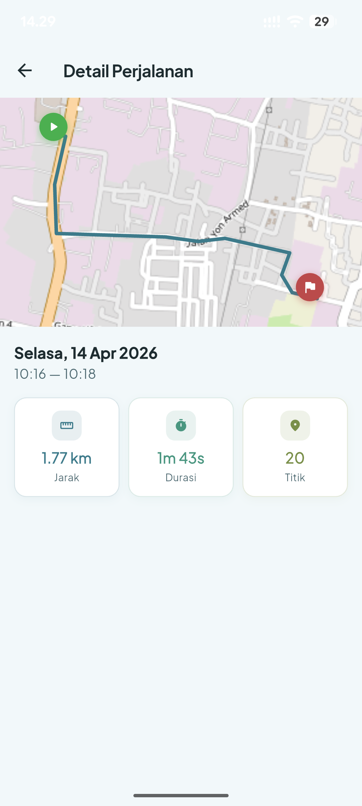
  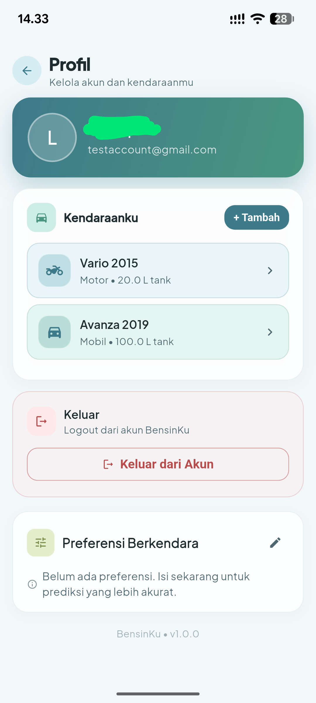
</p>

---

## Tech Stack

| Layer | Technology |
|---|---|
| **Mobile** | Flutter (Dart) — single codebase Android & iOS |
| **State** | StatefulWidget + FutureBuilder (no Bloc/Riverpod, dipertahankan ringan) |
| **Auth & DB** | Supabase Auth + PostgreSQL dengan Row Level Security |
| **Maps** | flutter_map + OpenStreetMap tiles (gratis, tanpa API key) |
| **GPS** | geolocator dengan foreground service untuk tracking saat layar mati |
| **AI** | OpenAI Vision (struk) + Chat (parsing voice transcript) lewat Supabase Edge Functions |
| **Voice** | speech_to_text untuk on-device transcription |
| **Typography** | IBM Plex Mono + IBM Plex Sans (editorial logbook style) |

---

## Architecture

```
┌─────────────────────┐         ┌──────────────────────────┐
│   Flutter App       │         │   Supabase                │
│                     │         │                           │
│  • Auth Gate        │ ──auth─▶│  • auth.users             │
│  • Onboarding       │         │  • Postgres (RLS)         │
│  • Dashboard        │ ◀─REST──│    └─ schema: bensinku    │
│  • Prediction Svc   │         │  • Edge Functions (Deno)  │
│  • Trip Service     │         │    ├─ parse-fuel-receipt  │
│                     │ ─image─▶│    └─ parse-fuel-voice    │
└─────────────────────┘         └──────────────────────────┘
         │                                  │
         │                                  ▼
         │                        ┌──────────────────┐
         └──── tile request ─────▶│  OpenStreetMap   │
                                  └──────────────────┘
                                           │
                                           ▼
                                  ┌──────────────────┐
                                  │     OpenAI       │
                                  │  Vision + Chat   │
                                  └──────────────────┘
```

**Auth Gate** (`lib/app/app.dart`) menjadi single source of truth untuk routing. Setiap kali app boot atau session berubah, gate evaluasi state user secara berurutan: nama → kendaraan → kelengkapan data referensi → preferensi wajib → dashboard. Kalau di tengah onboarding user kill app, boot berikutnya gate auto-resume di langkah yang belum kelar.

**Prediction Service** (`lib/services/prediction_service.dart`) memakai Bayesian-style weighted mean: `posterior = (α·prior + Σ samples) / (α + n)`. Prior dihitung dari karakteristik kendaraan (base km/L per CC × age factor × transmission factor × city factor). Sampel di-recordkan otomatis tiap kali user catat pengisian dengan flag `is_full_tank=true`.

**Trip Service** (`lib/services/trip_service.dart`) men-stream GPS dengan high-accuracy + foreground service di Android (`ForegroundNotificationConfig`) dan background mode di iOS (`allowBackgroundLocationUpdates`). Waypoints di-batch dan flush ke Supabase tiap 30 detik untuk hemat network.

---

## Database Schema

Semua tabel hidup di schema `bensinku` (bukan `public`) supaya bisa coexist dengan app lain dalam satu instance Supabase.

```
auth.users (Supabase Auth)
└── bensinku
    ├── vehicles
    │   ├── id, name, vehicle_type (motor/mobil)
    │   ├── tank_capacity_liters
    │   └── engine_cc, manufacturing_year, body_type,
    │       transmission, make_model         ← Predictions v2
    │
    ├── refuels
    │   ├── id, vehicle_id, fuel_product_id
    │   ├── refuel_date, total_rp, liters
    │   └── is_full_tank, odometer_km
    │
    ├── fuel_efficiency_samples              ← Predictions v2
    │   ├── from_refuel_id, to_refuel_id
    │   ├── km_traveled, liters_filled
    │   └── km_per_liter (generated column)
    │
    ├── fuel_products & fuel_prices
    │
    ├── trips
    │   ├── started_at, ended_at, distance_km
    │   └── trip_waypoints (lat, lng, recorded_at)
    │
    └── (RLS: setiap row di-scope ke auth.uid())
```

User metadata di `auth.users.raw_user_meta_data`:
- `name` — nama tampilan
- `usage_profile` — `daily_commute` / `weekend` / `mixed` / `fieldwork`
- `primary_city` — `jakarta` / `bandung` / `surabaya` / `mid_sized` / `rural`
- `weekly_km`, `weekly_refuel_count`, `preferred_fuel_id` (semua opsional)

Migrations di [`supabase/migrations/`](supabase/migrations/).

---

## Edge Functions

| Function | Input | Output | Model |
|---|---|---|---|
| [`parse-fuel-receipt`](supabase/functions/parse-fuel-receipt/) | image bytes (base64 atau URL) + MIME | `ParsedRefuel` JSON terstruktur | OpenAI Vision |
| [`parse-fuel-voice`](supabase/functions/parse-fuel-voice/) | transcript text | `ParsedRefuel` JSON terstruktur | OpenAI Chat |

Keduanya pakai env var bersama:
- `OPENAI_API_KEY`
- `OPENAI_BASE_URL`
- `OPENAI_CHAT_MODEL`

Output `ParsedRefuel` mengandung `vehicle_id`, `fuel_product_id`, `liters`, `total_rp`, `price_per_liter`, `refuel_date`, `is_full_tank`, plus `confidence` (`high` / `medium` / `low`) dan `reasoning` untuk transparansi.

---

## Repo Structure

```
bensinku/
├── lib/
│   ├── app/                      # MaterialApp, theme, auth gate
│   │   ├── app.dart              # _AuthGate + _RegisteredGate routing
│   │   └── theme.dart            # AppEditorial palette + typography
│   ├── config/
│   │   └── app_config.dart       # Env var loader
│   ├── data/
│   │   ├── models.dart           # Vehicle, Refuel, Trip, EfficiencySample, enums
│   │   └── repository.dart       # SupabaseRepository (semua DB I/O)
│   ├── features/
│   │   ├── auth/                 # Sign in, sign up, forgot password
│   │   ├── home/                 # Dashboard, analisa, arsip, profil, sheets
│   │   ├── onboarding/           # Welcome → profil → kendaraan → preferensi
│   │   └── trip/                 # GPS tracker + detail trip
│   ├── services/
│   │   ├── prediction_service.dart   # Bayesian km/L estimator
│   │   ├── refuel_parser_service.dart # Edge function client
│   │   ├── trip_service.dart         # GPS streaming + foreground service
│   │   ├── supabase_bootstrap.dart   # Client init
│   │   └── vehicle_assets.dart       # Photo asset resolver
│   └── widgets/
│       └── vehicle_cover.dart    # Reusable photo widget
├── supabase/
│   ├── migrations/               # Forward-only schema migrations
│   ├── functions/                # Deno edge functions
│   └── schema.sql                # Initial schema reference
├── assets/
│   ├── illustrations/            # Editorial-style scene illustrations
│   ├── vehicles/                 # Vehicle photos (user uploads + defaults)
│   └── icon.png                  # App launcher icon
└── android/, ios/, web/, etc.    # Platform projects
```

---

## Getting Started

### Prerequisites

- Flutter SDK 3.22+
- Project Supabase dengan schema `bensinku` (lihat [`supabase/migrations/`](supabase/migrations/))
- API key untuk OpenAI (atau provider kompatibel) jika ingin pakai fitur scan struk & voice input

### Install

```bash
git clone https://github.com/diopratama99/BensinKu.git
cd BensinKu
flutter pub get
```

### Configure

Salin file env contoh dan isi credential:

```bash
cp supabase.defines.example.json supabase.defines.json
```

```json
{
  "SUPABASE_URL": "https://<project>.supabase.co",
  "SUPABASE_ANON_KEY": "eyJ..."
}
```

> File `supabase.defines.json` sudah masuk `.gitignore`. Jangan commit credential.

Untuk Edge Functions, set secrets via Supabase CLI:

```bash
supabase secrets set OPENAI_API_KEY=sk-...
supabase secrets set OPENAI_CHAT_MODEL=gpt-4o-mini
supabase secrets set OPENAI_BASE_URL=https://api.openai.com/v1
supabase functions deploy parse-fuel-receipt
supabase functions deploy parse-fuel-voice
```

### Run

```bash
flutter run --dart-define-from-file=supabase.defines.json
```

### Build Release

```bash
flutter build apk --release --dart-define-from-file=supabase.defines.json
flutter build ios --release --dart-define-from-file=supabase.defines.json
```

Untuk regenerate launcher icon & splash setelah ganti `assets/icon.png`:

```bash
dart run flutter_launcher_icons
dart run flutter_native_splash:create
```

---

## License

Proyek ini dibuat untuk keperluan pribadi & tugas akademik.
